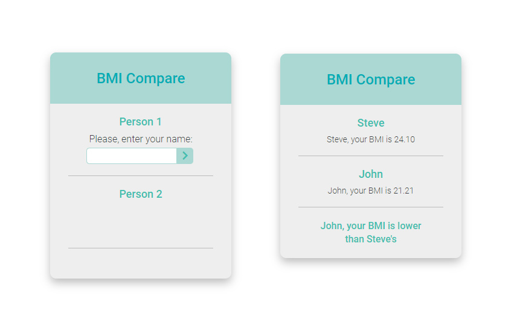

# BMI Compare Tool Component

This is a simple JavaScript challenge for practice.

## Table of contents

- [Overview](#overview)
  - [The challenge](#the-challenge)
  - [Screenshot](#screenshot)
  - [Links](#links)
- [My process](#my-process)
  - [Built with](#built-with)
  - [How I did it](#how-i-did-it)
  - [Useful resources](#useful-resources)
- [Author](#author)

## Overview

### The challenge

Users should be able to:

- View the component on every device screen size
- Input values with validation implemented
- Receive a correct result of comparison displayed

### Screenshot



### Links

- Solution URL: [GitHub repository](https://github.com/AyulaBoyilo/BMIcompareComponent/)
- Live Site URL: [GitHub Pages](https://ayulaboyilo.github.io/BMIcompareComponent/)

## My process

### Built with

- HTML5
- CSS3
- Flexbox
- JavaScript

### How I did it

Added even listeners to submit links, which validate the input before revealing the next form.
A simple form validation checks for invalid input. The name is required, height and weight should be numbers. The number input allows for and corrects small mistakes: 24.5kg is coverted to 24.5, but 'twenty four' is not allowed.
After the last form, the result is calculated and displayed.

Used Element.insertAdjacentHTML() to add alerts for incorrect input to avoid reparsing which would disable the event listeners.

```js
function submitPlayer1Weight() {
  player1Weight = parseFloat(document.querySelector("#player1Weight").value);

  if (!isNaN(player1Weight)) {
    // hide current form, reveal next form and remove alerts
    document.querySelector(".player-1-weight").classList.add("hide");
    document.querySelector(".player-1-height").classList.remove("hide");
    if (document.querySelector(".alert")) {
      document.querySelector(".alert").remove();
    }
  } else {
    if (document.querySelector(".alert")) {
      // remove existing alerts to avoid duplication
      document.querySelector(".alert").remove();
    } else {
      // add alert
      document
        .querySelector(".player-1-weight")
        .insertAdjacentHTML(
          "beforeend",
          '<span class="alert">Only numbers, please.</span>'
        );
    }
  }
}
```

### Useful resources

- [Element.insertAdjacentHTML()](https://developer.mozilla.org/en-US/docs/Web/API/Element/insertAdjacentHTML) - MDN Element.insertAdjacentHTML() page.

## Author

- Ayula Boyilo
